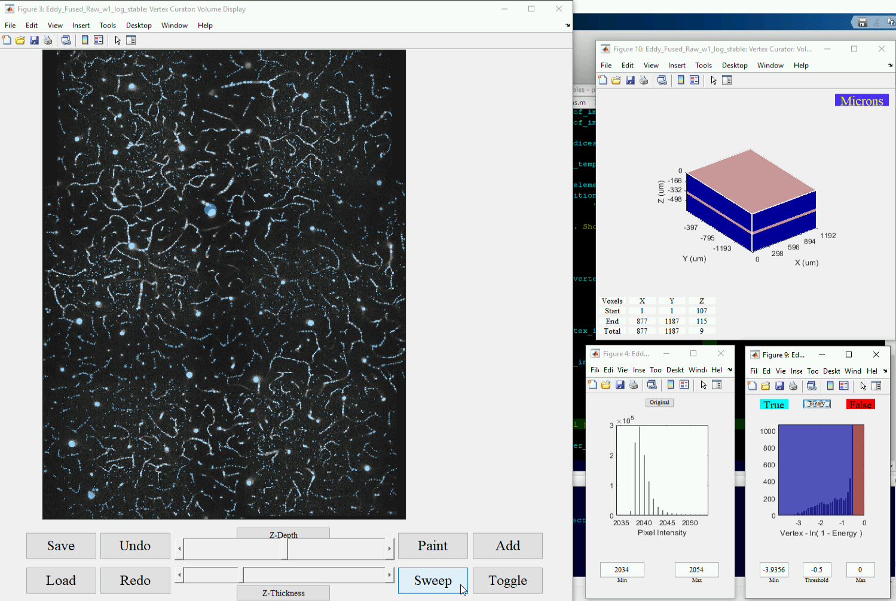
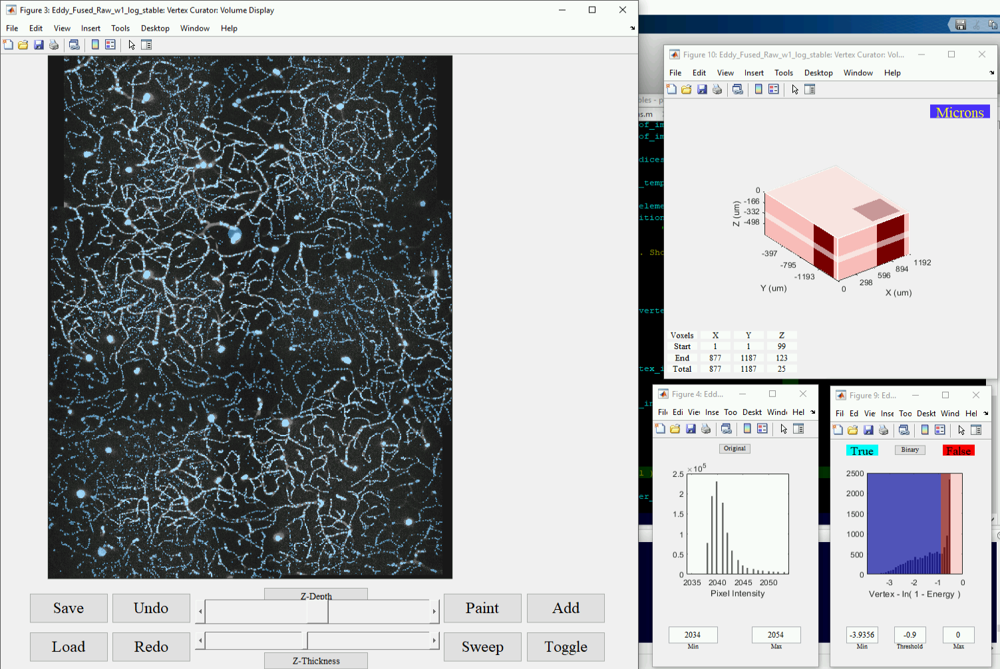

# Vectorization-Public README
## Public [GNU GPL-3.0 license](https://github.com/UTFOIL/Vectorization-Public/blob/master/LICENSE) 
### repository for SLAVV software.
#### The main function is called [```vectorize_V200.m```](https://github.com/UTFOIL/Vectorization-Public/blob/master/vectorize_V200.m) (documentation at the [end of this README](https://github.com/UTFOIL/Vectorization-Public#documentation-for-the-main-vectorization-function-in-matlab)).

Clone [this repo](https://github.com/UTFOIL/Vectorization-Public.git) and call [```vectorize_V200```](https://github.com/UTFOIL/Vectorization-Public/blob/master/vectorize_V200.m) in the command window of MATLAB with no inputs to be walked through the inputs.

Example inline calls can be found in the vectorization scripts, ```vectorization_script_.*.m```. ([Example 1](https://github.com/UTFOIL/Vectorization-Public/blob/master/vectorization_script_2017MMDD_TxRed_chronic.m), [2](https://github.com/UTFOIL/Vectorization-Public/blob/master/vectorization_script_michael.m), ...), and in the [performance sensitivity to image quality testing script](https://github.com/UTFOIL/Vectorization-Public/blob/master/noise_sensitivity_study_V2.m).

#### Enjoy, leave comments/suggestions, download, change, share (please include the [LICENSE file](https://github.com/UTFOIL/Vectorization-Public/blob/master/LICENSE)), ....

### [please cite the methods paper](https://www.biorxiv.org/content/biorxiv/early/2020/06/16/2020.06.15.151076.full.pdf):
```
https://www.biorxiv.org/content/biorxiv/early/2020/06/16/2020.06.15.151076.full.pdf
```

### bibtex citation:

```
@article{mihelic2020segmentation,
  title={Segmentation-less, automated vascular vectorization robustly extracts neurovascular network statistics from in vivo two-photon images},
  author={Mihelic, Samuel and Sikora, William and Hassan, Ahmed and Williamson, Michael and Jones, Theresa and Dunn, Andrew},
  journal={bioRxiv},
  year={2020},
  publisher={Cold Spring Harbor Laboratory}
}
```

### Documentation 
for the [main vectorization function](https://github.com/UTFOIL/Vectorization-Public/blob/master/vectorize_V200.m) in MATLAB:
```
https://github.com/UTFOIL/Vectorization-Public/blob/master/vectorize_V200.m
```
```
%% Vectorize_V200 - Samuel Alexander Mihelic - Novemeber 8th, 2018                                  
% VECTORIZE( ) prompts the user at the command window for all required inputs.  It first asks 
%     whether to vectorize a new batch of images or continue with a previous batch.  A batch is a
%     group of images that the VECTORIZE function organizes together with two properties:
%
%         1) The same set of input parameters applies to every image in a batch. 
% 
%         2) The images in a batch are processed in parallel at each step of the vectorization. 
%            (see Methods below for descriptions of the four steps in the vectorization algorithm).
%
%       If the user continues with a previous batch, VECTORIZE prompts the user to select a previous
%       batch folder with data to recycle.
%
%       Alternatively, if the user starts a new batch, VECTORIZE prompts the user to select a folder
%       with some image file(s) to be vectorized.  It makes a new batch folder in a location
%       specified by the user.
% 
%     In either case, VECTORIZE prompts the user for a few logistical inputs: which vectorization
%     step(s) to execute, what previous data or settings (if any) to recycle, which visual(s) to
%     output (if any), and whether or not to open a graphical curator interface. It also prompts the
%     user for workflow-specific parameters: It displays imported parameters for review, and prompts
%     the user for any missing required parameters.  VECTORIZE writes any outputs to the batch
%     folder with a time stamp of the form YYMMDD_HHmmss.
% 
%   Conventions:  Greater values in the IMAGE_MATRIX correspond to greater vascular signal
%                 The IMAGE_MATRIX dimensions correspond to the physical dimensions y, x, and z
%                 (1,x,z) is the top  border of the x-y image at height z
%                 (y,1,z) is the left border of the x-y image at height z
%                 (y,x,1) is the x-y image nearest to the objective
%
%   Supported input image file types: .tif
%
% For in-line function calls that do not require manual interfacing (e.g. for writing wrapper
% functions or for keeping a concise record of VECTORIZE function calls in a script file), see the
% Optional Input, Logistical Parameters, and Workflow Specific Parameters Sections.
% 
% Note:  For more organizational/navigational control over this document in MATLAB:
%           1) open the Preferences Window                                       (HOME>>PREFERENCES)
%           2) enable Code Folding for Sections              (MATLAB>>Editor/Debugger>>Code Folding)
%           3) fold all of the sections in this document                                    (ctrl,+)
%
%% ------------------------------------------- Overview ------------------------------------------- 
%
% The purpose of the vectorization algorithm is to convert a grayscale, 3D image of vasculature (see
% Inputs section) to a vectorized model of the vascular components.  The output model consists of a
% list of many spherical objects with 3D-position (x,y,z), radius (r), and a contrast metric (c, see
% Methods section). These objects are vectors because each object is a 5-tuples of real numbers:
% [x,y,z,r,c].  The output vectors can then be rendered as a 2- or 3-dimensional image at any
% requested resolution, or it could be analyzed for statistical properties such as volume fraction
% or bifurcation density. With these objects in hand, many analyses are greatly simplified. Many
% such demonstrations and visualizations are automatically output (see Outputs section).
%
%% ---------------------------------------- Optional Input ---------------------------------------- 
%
% VECTORIZE( IMAGE_MATRIX ) vectorizes the numerical array IMAGE_MATRIX.  A batch folder is made 
%     in the OutputDirectory specified by the user. The user is prompted for the other logistical
%     and workflow specific parameters as in the VECTORIZE( ) call.
%
%   Supported IMAGE_MATRIX variable types: 3D array of doubles
% 
%   -  -  -  -  -  -  -  -  -  -  -  -  -  -  -  -  -  -  -  -  -  -  -  -  -  -  -  -  -  -  -  -   
%
% VECTORIZE( IMAGE_MATRICES ) vectorizes each IMAGE_MATRIX in the cell vector IMAGE_MATRICES.  The
%     outputs in the batch folder are numbered by the input order of the images in the cell vector.
% 
%   Supported IMAGE_MATRICES variable types: Cell vector of 3D array of doubles
%
%    -  -  -  -  -  -  -  -  -  -  -  -  -  -  -  -  -  -  -  -  -  -  -  -  -  -  -  -  -  -  -  -   
%
% VECTORIZE( FILE_NAME ) vectorizes the IMAGE_MATRIX(-CES) specified by the path(s) in FILE_NAME.
%
%   Supported FILE_NAME variable types: character vectors
%
%   FILE_NAME is an absolute or relative paths to current working folder. Wild card commands (i.e.
%       '*' or '**' ) in the FILE_NAME are also supported. For example:
%
%     VECTORIZE(    '*.tif'  ) vectorizes all .tif files in the current directory.
%
%     VECTORIZE([ '**', filesep, '*.tif' ]) vectorizes all .tif files in the current directory or any
%         subdirectory thereof.
% 
%  -  -  -  -  -  -  -  -  -  -  -  -  -  -  -  -  -  -  -  -  -  -  -  -  -  -  -  -  -  -  -  -  -
%
% VECTORIZE( FILE_NAMES ) vectorizes the IMAGE_MATRICES specified by the cell vector of FILE_NAMES.
%
%   Supported FILE_NAMES variable types: Cell vector of character vectors
%
%% -------------------------------------- Logistical Parameters ----------------------------------- 
%
% VECTORIZE( ..., NAME, VALUE ) 
%     uses the following NAME/VALUE pair assignments for logistical inputs:
%
% ------- NAME -------      -------------------------------- VALUE --------------------------------
%
% 'OutputDirectory'         Char or string specifying the folder that contains the output batch
%                           folder.  The default is to prompt the user at the command window.
% 
% 'NewBatch'                'prompt' - Prompts the user at the command window.
%                           'yes'    - Makes a new batch folder in the OutputDirectory folder. 
%                                      This is the only option if the user provides the Optional
%                                      Input.
%                           'no'     - Writes into an existing batch folder in the OutputDirectory.
%
% 'PreviousBatch'           'prompt' (default) - Prompts the user to input a previous batch folder.
%                           'none'             - Does not import any existing data or settings.  If
%                                                NewBatch is 'no', this is  not an  option.
%                           'yyMMdd-HHmmss'    - Imports from the batch_yyMMdd-HHmmss folder in the 
%                                                OutputDirectory.
%                           'recent'           - Imports from the most recent batch_* folder in the
%                                                OutputDirectory.
%
% 'PreviousWorkflow'        'prompt' (default) - Prompts the user to input a previous settings file.
%                           'none'             - Does not import any existing data or settings.  If
%                                                NewBatch is 'no', this is not an option.
%                           'yyMMdd-HHmmss'    - Imports from the workflow_yyMMdd-HHmmss folder in
%                                                the batch folder. 
%                           'recent'           - Imports from the most recent workflow_settings_* 
%                                                folder in the batch folder.
%
% 'StartWorkflow'           Note: These are listed in order:  Energy is the first process.
% 
%                           'prompt' (default) - Prompts the user at the command window.
%                           'none'             - Does not run any workflow steps.  The user may run
%                                                curatation or visual steps.
%                           'next'      - Starts the vectorization process at the   next   step for
%                                         the selected PreviousWorkflow.
%                           'energy'    - Starts the vectorization process at the  Energy  step.
%                                         This is the only option if NewBatch is 'yes'.
%                           'vertices'  - Starts the vectorization process at the Vertices step.
%                           'edges'     - Starts the vectorization process at the   Edges  step.
%                           'network'   - Starts the vectorization process at the  Network step.
%
% 'FinalWorkflow'           'prompt'(default) - Prompts the user at the command window.
%                           'none'            - Does not run any vectorization processes.  
%                                               This is the only option if StartWorkflow is 'none'
%                           'one'       - Ends the vectorization process at the StartWorkflow step.
%                           'energy'    - Ends the vectorization process at the    Energy     step.
%                           'vertices'  - Ends the vectorization process at the   Vertices    step.
%                           'edges'     - Ends the vectorization process at the     Edges     step.
%                           'network'   - Ends the vectorization process at the    Network    step.
%
% 'Visual'                  'none'                 - Does not write visual outputs.
%                           'original'             - Writes visuals for just the input images.
%                           'energy'               - Writes visuals for just the   Energy step.
%                           'vertices'             - Writes visuals for just the Vertices step.
%                           'edges'                - Writes visuals for just the    Edges step.
%                           'network'              - Writes visuals for just the  Network step.
%                           { ... }                - Writes visuals for just the    ...   steps.
%                           'productive' (default) - Writes visuals for just the workflow steps.
%                                                    being executed at this vectorization call.
%                           'all'                  - Writes visuals for all vectorization steps.
% 
% 'SpecialOutput'           'none'           - Does not create any special network outputs.
%                           'histograms'     - (defualt) shows strand, length statistic histograms
%                           'depth-stats'    - Shows depth-resolved statistics.
%                           'flow-field'     - Writes x, y, and z component .tif's of flow field.
%                           'depth'          - Shows vectors over raw with color-coded depth.               
%                           'strands'        - Shows vectors over raw with color-coded strands.
%                           'directions'     - Shows vectors over raw with color-coded direcions.
%                           '3D-strands'     - Shows 3D volume rendering with color-coded strands.
%                           'casX'           - Creates .casX equivalent representation of strands.
%                                              Format .casX is due to LPPD in Chicago.
%                           { ... }          - Creates ... special network outputs.
%                           'all'            - Creates all special network outputs.
% 
% 'VertexCuration'          'auto'             - All non-overlapping vertices are passed to edges. 
%                                                Chooses least energy vector upon volume conflict. 
%                           'manual' (default) - Prompts user with a graphical curation interface.
%                           'machine-manual'   - Applies neural network categorization and then
%                                                prompts user with a graphical interface.
%                           'machine-auto'     - Applies neural network categorization and then
%                                                all non-overlapping vertices are passed to edges.
%                                                Chooses best vector according to the neural network
%                                                upon volume conflict.
%
% 'EdgeCuration'            'auto'             - All edges are passed to network.
%                           'manual' (default) - Prompts user with a graphical curation interface.
%                           'machine-manual'   - Applies neural network categorization and then
%                                                prompts user with a graphical interface.
%                           'machine-auto'     - Applies neural network categorization.  All edges 
%                                                are passed to network.
% 
% 'NetworkPath'             'prompt
%                           'built-in' (default) - Built-in network ...
%                           'train'              - Trains new network from all curation files found
%                                                  in the training folder in the vectorization base 
%                                                  directory.
%                           'yyMMdd-HHmmss'      - Imports network trained at yyMMdd-HHmmss from the 
%                                                  network folder in the vectorization base
%                                                  directory.
%                           'recent'             - Imports network trained most recently from the 
%                                                  network folder in the vectorization base
%                                                  directory.
%
% 'Forgetful'               'none' (default)   - No intermediate data files will be deleted
%                           'original'         - Deletes intermediate copies of the input images
%                           'energy'           - Deletes intermediate Energy data files
%                           'both'             - Deletes both intermediate data files when done
%
% 'Presumptive'             false (default) - Prompts user for all required workflow-specific inputs
%                           true            - Assumes previous settings or default if no previous
%% ------------------------------- Workflow-Specific Parameters ----------------------------------- 
%
% VECTORIZE( ..., NAME, VALUE ) 
%     uses the NAME/VALUE pair assignments listed below to input workflow-specific parameters.  Each
%     parameter is listed below under the first workflow step that it modifies.
%   
%   Resolving conflicts between NAME/VALUE pairs and imported parameters from the PreviousWorkflow:
% 
%       If a NAME/VALUE pais is provided for a parameter that modifies a workflow step that is
%       upstream of the StartWorkflow, then that value is ignored and the value from the
%       PreviousWorkflow value will remain. A warning is produced.  This must occur because the
%       relevant workflow has already been executed and is not scheduled to run again, therefore the
%       parameters that modify it will not change.
%
%       If a NAME/VALUE pair is provided for a parameter that only modifies workflows that are equal
%       to or downstream of the StartWorkflow, then that value will overwrite any value that may
%       have been retrieved from the PreviousWorkflow.  The overwriting is displayed in the commaind
%       window.
%
%%  -  -  -  -  -  -  -  -  -  -  -  -  -  -  -  -  - Energy -  -  -  -  -  -  -  -  -  -  -  -  -  
% ---------------- NAME ----------------  ------------------------- VALUE -------------------------
% 
% 'microns_per_voxel'                     Real, positive, three-element vector specifying the voxel
%                                         size in microns in y, x, and z dimensions, respectively.
%                                         Default: [ 1, 1, 1 ]
% 
% 'radius_of_smallest_vessel_in_microns'  Real, positive scalar specifying the radius of the
%                                         smallest vessel to be detected in microns.  Default: 1.5
% 
% 'radius_of_largest_vessel_in_microns'   Real, positive scalar specifying the radius of the largest 
%                                         vessel to be detected in microns.  Default: 50
% 
% 'approximating_PSF'                     Logical scalar specifying whether to approximate the PSF
%                                         using "Nonlinear Magic: Multiphoton Microscopy in the 
%                                         Biosciences" (Zipfel, W.R. et al.).  Default: true
% 
% 'sample_index_of_refraction'            Real, positive scalar specifying the index of refraction 
%                                         of the sample.  This parameter is only used if
%                                         approximating the PSF.  Default: 1.33
% 
% 'numerical_aperture'                    Real, positive scalar specifying the numerical aperture of
%                                         the microscope objective.  Default: 0.95
% 
% 'excitation_wavelength_in_microns'      Real, positive scalar specifying the excitation wavelength
%                                         of the laser in microns.  Default: 1.3
% 
% 'scales_per_octave'                     Real, positive scalar specifying the number of vessel 
%                                         sizes to detected per doubling of the radius cubed.  
%                                         Default: 1.5
% 
% 'max_voxels_per_node_energy'            Real, positive scalar specifying Default: 1e5
% 
% 'gaussian_to_ideal_ratio'               Real scalar between 0 and 1 inclusive specifying the
%                                         standard deviation of the Gaussian kernel per the total
%                                         object length for objects that are much larger than the
%                                         PSF. Default: 1
% 
% 'spherical_to_annular_ratio'            Real scalar between 0 and 1 inclusive specifying the
%                                         weighting factor of the spherical pulse over the combined
%                                         weights of spherical and annular pulses. This parameter is
%                                         only used if gaussian_to_ideal_ratio is strictly less than
%                                         unity.  Default: 1
%
%
%%   -  -  -  -  -  -  -  -  -  -  -  -  -  -  -  -   Edges   -  -  -  -  -  -  -  -  -  -  -  -  - 
% ---------------- NAME ----------------  ------------------------- VALUE -------------------------
% 
% 'max_edge_length_per_origin_radius'     Real, positive scalar specifying the maximum length of an
%                                         edge trace per the radius of the seed vertex. Default: 30
%
% 'number_of_edges_per_vertex'            Real, positive integer specifying the maximum number of
%                                         edge traces per seed vertex. Default: 4
%
%%  -  -  -  -  -  -  -  -  -  -  -  -  -  -  -  -   Network -  -  -  -  -  -  -  -  -  -  -  -  -  
% ---------------- NAME ----------------  ------------------------- VALUE -------------------------
% 
% 'sigma_strand_smoothing'                Real, non-negative integer specifying the standard
%                                         deviation of the Gaussian smoothing kernel per the radius
%                                         of the strand at every position along the strand vector.
%                                         Default: 1
%
%% ------------------------------------------- Methods -------------------------------------------- 
%
% Vectorization is accomplished in four steps:  (1) energy image formation, (2) vertex extraction,
% (3) edge extraction, and (4) network extraction.  The raw output is a superposition
% of possible models until it is segmented in some way.  The objects are assigned a contrast metric
% based on the values from the energy image, and thresholding them on this value provides direct
% control over the sensitivity and specificity of the vectorization.  Alternatively, the graphical
% curation interface provides a platform for manual segmentation such as local threshold selection
% or point-and-click object selection.
% 
% 1: Energy Image Formation
%     Multi-scale (at many pre-defined sizes) gradient and curvature information from the original
%     3D image is combined to form a 4-dimensional, multi-scale, centerline-enhanced, image, known
%     as the energy image.  Ideally, the voxels with the lowest energy value the energy image will
%     be the most likely to be centerline voxels for vessels in the pre-defined size range.  This
%     can be visually verified by inspecting the energy*.tif visual output in the visual output
%     directory.  The energy image should be very negative right at the vessel centerlines and close
%     to zero or positive elsewhere.  The value of the size image at a given voxel shows the index
%     of the pre-defined sizes that is most likely assuming a vessel is centered at that voxel.
% 
% 2: Vertex Extraction
%     Vertices are extracted as local minima in the 4D energy image (with associated x, y, z,
%     radius, and energy value).  This method was inspired by the first part of the SIFT algorithm
%     (David Lowe, International Journal of Computer Vision, 2004)).  Ideally, local minima of the
%     energy image correspond to voxels that are locally the most likely to be along a vessel
%     centerline. The size coordinate is also required to be at a local energy minimum.  In theory,
%     the vertices are ordered from most to least likely to exist by the energy values at their
%     locations.
% 
% 3: Edge Extraction
%     Edges are extracted as voxel to voxel random walks through the (min. projected to 3D) energy
%     image.  Therefore edges are lists of spherical objects like vertices.  Edge trajectories seek
%     lower energy values and are forced to connect exactly two vertices.  The trajectories between
%     vertices are in theory ordered from most to least likely to exist by their mean energy values.
% 
% 4: Network Extraction
%     Strands are defined as the sequences of non-branching edges (single random color in the
%     colored strands image).  Strands are found by counting the number of edges in the adjacency
%     matrix of the vertices.  Strands are the connected components of the adjacency matrix that
%     only includes vertices with two edges.  With the strands of the network in hand, we
%     equivalently know where the bifurcations in the network are.  Network information unlocks many
%     doors.  For instance, we can smooth the positions and sizes of the extracted vectors along
%     their strands and approximate local blood flow fields.
% 
%% ------------------------------------------- Output -------------------------------------------- 
%
% Standard network ouptut format(s): .casx
%
% The vectorization output is the set of 3-space locations and radii of all vessels as well as 
% their connectivity. This information is stored in several matlab variables in the network output 
% file in the vector directory of the batch_* directory output of the Vectorize function. This 
% vector information is also available in the casx file format if the user selects the 
% 'SpecialOutputs'/'casx' name/value pair input. The .casx standard file is due to LPPD at 
% University of Illinois at Chicago, Department of Bioengineering (https://lppd.bioe.uic.edu/)
```
### [Example Datasets](https://drive.google.com/drive/folders/1IO9PmpO0W_E1UaedvzdP5_PzHzfYGO_m?usp=sharing)

This folder contains the three example images as they were processed for the SLAVV methods paper.  
  
Each of the three "Image *" folders in this folder contains:  
	- The original image under its original title as a *.tif  
	- The wrapper script that was used to vectorize that image in a *.mat file  
	- All of the vectorization intermediates and outputs in a batch_* folder  

### [Tutorial](https://github.com/UTFOIL/Vectorization-Public/blob/master/tutorial/)

This folder contains screenshots demonstrating the use of the SLAVV software on three (A, B, and C) large, tiled images.

Images 1-2: Wrapper script: OutputDirectory and start_workflow parameters


Images 10's: Vertex Curator: Global threshold selection and application  
1XA:





1XB


1XC


Images 20's: Vertex Curator: Local  threshold selection and application and (for "B" images) individual vertex toggling  
2XA



2XB


2XC

Image  30's: Vertex Curator: Final curated Vertex set for edge tracing  
3XA

3XB


Images 40's:   Edge Curator: Volume navigation, exploration, and (for "B" and "C" images) local thresholding.  
4XA


4XB


4XC


Images 50's:   Edge Curator: Orthogonal Views  
5XA


Images 60's:   Edge Curator: Addition Tool  
6XA


Images 70's:   Edge Curator: Toggling Tool  
7XA


Image  79b :   Edge Curator: Final output MIP over the whole volume with graded edge color weighting.  
79B


Image    80: Maximum Intensity Projection Outputs (Coloring: strand uniques, depth, and direction) from the middle (1/3 in all 3 dimensions) of the vectors overlaying the image.  
8XA

8XB

8XC


Image    81: Histograms of various statistics of interest from the vectors in the image.  
81A  

81B  

81C


Images  90+: Visualizations of the output vectors using a .vmv file output to the VessMorphoVis plugin to Blender.  
9XA and 10XA  


9XB  


9XC  


