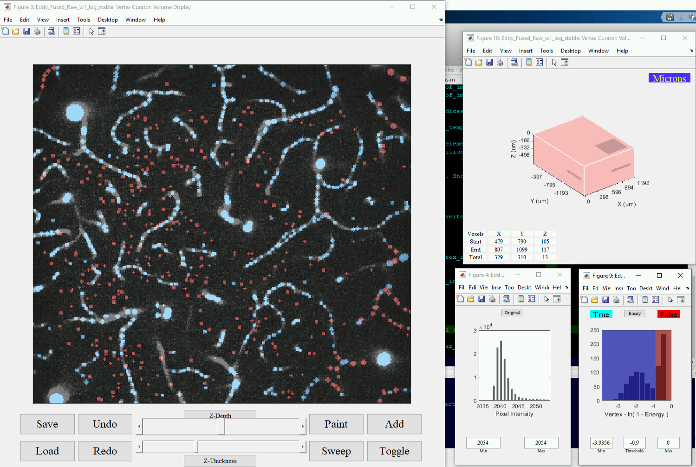
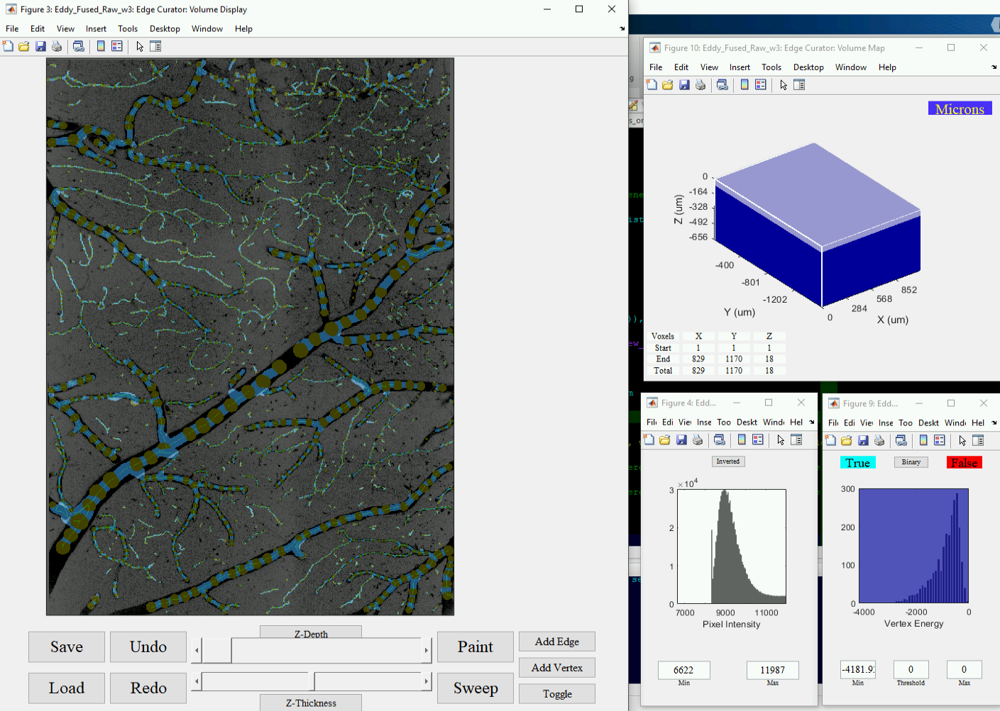

# **Interactive Curator Tutorial ReadMe**
## Segmentation-Less, Automated, Vascular Vectorization (SLAVV)
#### Software ([source in MATLAB](https://github.com/UTFOIL/Vectorization-Public/blob/master/source)) Tutorial
Demonstrating the use of the graphical curator interface (built-into the SLAVV software) on three large (~1 mm3), images of living adult mouse brain microvasculature. The three images (**Image A**, **B**, and **C**) are all from the same mouse, approximately the same field of view, and timed 2 weeks apart.

#### In the screenshots to follow in this tutorial, depictions of: 
**Image A** are in the left column | **Image B** the center | and **Image C** the right
:--------------------------------- | :--------------------: | ------------------------:

## SLAVV Methodology Overview

The SLAVV method consists of four workflow steps:
1. linear "energy" filtering
2. vertex extraction
3. edge extraction
4. network organization

### Table of Contents:
- [SLAVV Methodology Overview](https://github.com/UTFOIL/Vectorization-Public/blob/master/SLAVV_tutorial_readme.md#slavv-methodology-overview)
1. [Inputs and Parameters](https://github.com/UTFOIL/Vectorization-Public/blob/master/SLAVV_tutorial_readme.md#Inputs-and-Parameters)
  1. [Wrapper Script](https://github.com/UTFOIL/Vectorization-Public/blob/master/SLAVV_tutorial_readme.md#slavv-Wrapper-script)
2. [Vertex Extraction](https://github.com/UTFOIL/Vectorization-Public/blob/master/SLAVV_tutorial_readme.md#slavv-Vertex-Extraction)
2. [Vertex Curator](https://github.com/UTFOIL/Vectorization-Public/blob/master/SLAVV_tutorial_readme.md#slavv-Vertex-Curator)
  1. [Global Threshold Selection](https://github.com/UTFOIL/Vectorization-Public/blob/master/SLAVV_tutorial_readme.md#Global-threshold-selection)
 
<!--#### [This folder](https://github.com/UTFOIL/Vectorization-Public/blob/master/tutorial/) contains the screenshots demonstrating the use of the SLAVV software on **Images A**, **B**, and **C**.-->

## Inputs and Parameters

### Input Images

<!--Images 1-2:-->
### Wrapper Script
Image A Input Selection | Starting Workflow Step Selection
:---: | :---:
|-->

<!--Images 10's:-->
## Vertex Curator
### Global threshold selection
Image A | B | C
:---: | :---: | :---:
some_text | some_text | some_text
||
||
||
||
||
||
||

<!--Images 20's:--> 
### Local  Threshold Selection
A | B | C
:---: | :---: | :---:
||
||
||

### Individual Vertex Toggling
| A | B | C
| :---: | :---: | :---:
|||
|||
|||
|||

<!--Image  30's: -->
### Vertex Curator: Final curated Vertex set for edge tracing  
3XA

3XB

### Images 40's:   Edge Curator: Volume navigation, exploration, and (for "B" and "C" images) local thresholding.  
4XA

4XB

4XC

### Images 50's:   Edge Curator: Orthogonal Views  
5XA

### Images 60's:   Edge Curator: Addition Tool  
6XA

### Images 70's:   Edge Curator: Toggling Tool  
7XA

### Image  79b :   Edge Curator: Final output MIP over the whole volume with graded edge color weighting.  
79B

### Image    80: Maximum Intensity Projection Outputs (Coloring: strand uniques, depth, and direction) from the middle (1/3 in all 3 dimensions) of the vectors overlaying the image.  
8XA

8XB

8XC

### Image    81: Histograms of various statistics of interest from the vectors in the image.  
81A  

81B  

81C

### Images  90+: Visualizations of the output vectors using a .vmv file output to the VessMorphoVis plugin to Blender.  
9XA and 10XA  

9XB  

9XC  

